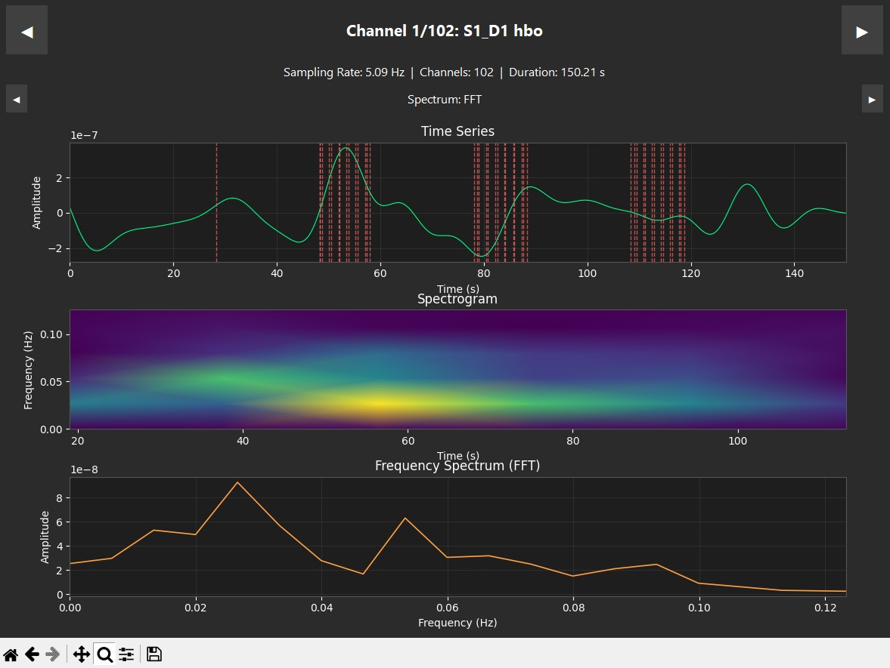
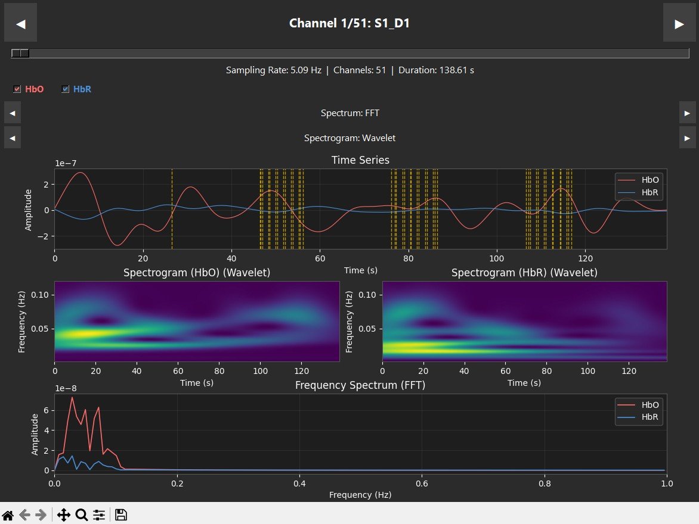

# neuropipeline

`neuropipeline` is a Python package designed for comprehensive analysis of neurophysiological data, specifically Electroencephalography (EEG) and functional Near-Infrared Spectroscopy (fNIRS). It provides tools for preprocessing, analysis, and visualization of both EEG and fNIRS data, streamlining your neuroimaging workflow.

## Usage

```python
from neuropipeline.fnirs import fNIRS
import neuropipeline.visualizer as nplv

fnirs = fNIRS("path/to/your_file.snirf")
fnirs.preprocess(
    optical_density=True,
    hemoglobin_concentration=True,
    temporal_filtering=True,
    normalization=False,
    detrending=True
)

nplv.open(fnirs)

snirf.write_snirf("path/to/your_new_file.snirf") # WARNING: Be cautious not to overwrite any data you want to keep. 
```

## Example
These examples show single trials from a subject during a heel-stimulation experiment. The time series, spectrogram and frequency (PSD, FFT) are plotted for each case. The red dashed lines represent markers in the data, specifically when each block starts (rest, task) as well as metadata markers describing the robot's movement and actions. The stimuli was delivered as 6 indentations and subsequent shears of the heel edge by a robot actuator. In the supination case (left), we see a clear correlation with increased HbO in the first two stimuli periods. Looking at the spectrogram (y: 0.00-0.10 Hz), the neurogenic band centered at 0.025 Hz shows activity throughout, with notable spikes coinciding with the HbO increases at stimuli onset. This is a strong indication of captured neurogenic activity in the sensory cortex resulting from mechanical stimulation of the lateral heel edge. The pronation case (right) does not exhibit the same pattern; neurogenic activity remains consistently low across the trial spectrogram, and while the time series shows some local peaks during task durations,  

<table>
  <tr>
    <td></td>
    <td></td>
  </tr>
  <tr>
    <td align="center"><em>Supination</em></td>
    <td align="center"><em>Pronation</em></td>
  </tr>
</table>

## Features

* **Unified Interface:** A consistent API for both EEG and fNIRS data processing.
* **Preprocessing:**
    * Artifact removal (e.g., ICA, filtering).
    * Data cleaning and interpolation.
    * Channel/probe management.
* **Analysis:**
    * Frequency domain analysis (e.g., power spectral density).
    * Time domain analysis (e.g., event-related potentials/responses).
    * Statistical analysis.
    * fNIRS specific analysis (HbO, HbR, and HbT calculations)
* **Visualization:**
    * Interactive plots for EEG and fNIRS data.
    * Topographic maps.
    * Time-series plots.
    * fNIRS channel location visualization.
* **Extensible Design:** Easily add custom processing and analysis modules.
* **Well-Documented:** Comprehensive documentation with examples and tutorials.

## Installation

```bash
python -m pip install neuropipeline
